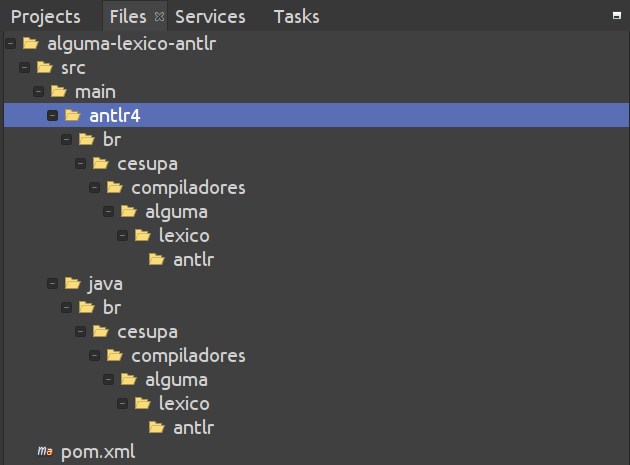
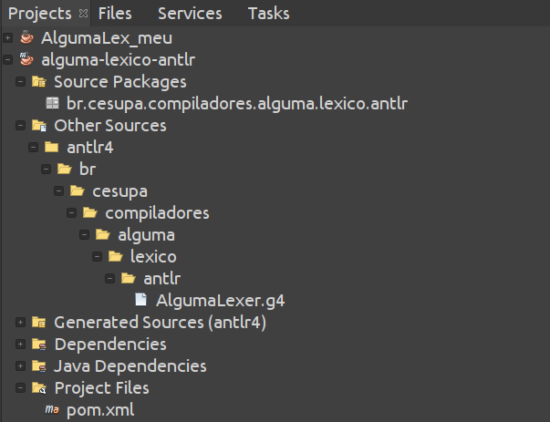

# Adaptado de Construção de Compiladores - Daniel Lucrédio, Helena Caseli, Mário César San Felice e Murilo Naldi (UFSCar)
## Tópico 02 - Análise Léxica - Exemplos

### Demonstração 4 – Analisador léxico com ANTLR

---

1. Acessar o site do ANTLR (www.antlr.org). Nesta demonstração faremos a instalação pelo Maven
2. Abrir o NetBeans e criar novo projeto Java Maven

- Project name: ```alguma-lexico-antlr```
- Group Id: ```br.cesupa.compiladores```
- Modificar o arquivo pom.xml para incluir a dependência para o ANTLR e o plugin do ANTLR
- No XML abaixo, ajuste apenas da tag ```<build>``` para baixo

```xml
<?xml version="1.0" encoding="UTF-8"?>
<project xmlns="http://maven.apache.org/POM/4.0.0" xmlns:xsi="http://www.w3.org/2001/XMLSchema-instance" xsi:schemaLocation="http://maven.apache.org/POM/4.0.0 http://maven.apache.org/xsd/maven-4.0.0.xsd">
    <modelVersion>4.0.0</modelVersion>
    <groupId>br.cesupa.compiladores</groupId>
    <artifactId>alguma-lexico-antlr</artifactId>
    <version>1.0-SNAPSHOT</version>
    <packaging>jar</packaging>
    <properties>
        <project.build.sourceEncoding>UTF-8</project.build.sourceEncoding>
        <maven.compiler.source>11</maven.compiler.source>
        <maven.compiler.target>11</maven.compiler.target>
    </properties>
    <build>
        <plugins>
            <plugin>
                <groupId>org.antlr</groupId>
                <artifactId>antlr4-maven-plugin</artifactId>
                <version>4.7.2</version>
                <executions>
                    <execution>
                        <id>antlr</id>
                        <goals>
                            <goal>antlr4</goal>
                        </goals>
                    </execution>
                </executions>
            </plugin>            
            <plugin>
                <artifactId>maven-assembly-plugin</artifactId>
                <configuration>
                    <archive>
                        <manifest>
                            <mainClass>br.cesupa.compiladores.alguma.lexico.antlr.Principal</mainClass>
                        </manifest>
                    </archive>
                    <descriptorRefs>
                        <descriptorRef>jar-with-dependencies</descriptorRef>
                    </descriptorRefs>
                </configuration>
                <executions>
                    <execution>
                        <id>make-assembly</id>
                        <phase>package</phase>
                        <goals>
                            <goal>single</goal>
                        </goals>
                    </execution>
                </executions>
            </plugin>
        </plugins>
    </build>
    <dependencies>
        <dependency>
            <groupId>org.antlr</groupId>
            <artifactId>antlr4</artifactId>
            <version>4.7.2</version>
            <classifier>complete</classifier>
        </dependency>
    </dependencies>    
</project>
```

3. Criar um novo arquivo do tipo ANTLR Lexer Grammar, chamado AlgumaLexer.g4
- O plugin ANTLR-Maven exige que o arquivo com a gramática seja incluído em um diretório específico dentro da pasta src/main do projeto. Esse diretório só pode ser criado na aba “arquivos/files” do NetBeans. Esse diretório deve se chamar “antlr4” e deve ter a mesma estrutura de diretórios que os pacotes Java. A figura a seguir ilustra o local exato onde deve ser criado o arquivo. Observe que é necessário alternar para a aba “arquivos/files” (topo da imagem):



- Voltando para a aba "Projetos/Projects", fica assim:



- O conteúdo do arquivo é o seguinte:

```
lexer grammar AlgumaLexer;

Letra       : 'a'..'z' | 'A'..'Z';
Digito      : '0'..'9';
Variavel    : Letra(Letra|Digito)* { System.out.print("[Var,"+getText()+"]");};
```

4. Mandar gerar o reconhecedor
- Basta clicar com o botão direito no projeto e selecionar a opção “Build/Construir”. Será gerada uma nova pasta de código-fonte, chamada “Generated sources (antlr4)”, onde o código gerado terá a estrutura correta de pacotes.
- Na primeira vez que o projeto é contruído ("buildado"), os pacotes são baixados do repositório Maven para a sua máquina.
- Caso exista algum erro no arquivo da gramática, o processo irá gerar um erro. Observar na janela de “Saída/output” para identificar a origem do erro.

5. Criar a classe br.cesupa.compiladores.compilador.alguma.lexico.antlr.Principal:

```java
package br.cesupa.compiladores.alguma.lexico;

import java.io.IOException;
import org.antlr.v4.runtime.CharStream;
import org.antlr.v4.runtime.CharStreams;
import org.antlr.v4.runtime.Token;

public class Principal {

    public static void main(String[] args) {
        try {
            CharStream cs = CharStreams.fromFileName(CAMINHO_PARA_O_ARQUIVO_DO_PROGRAMA_ALGUMA_ENTRE_ASPAS_DUPLAS);
            AlgumaLexer lex = new AlgumaLexer(cs);
            while (lex.nextToken().getType() != Token.EOF) {
                System.out.println("");
            }
        } catch (IOException ex) {
        }
    }
}
```

6. Testar
- Construir ("buildar") o projeto novamente.
- Executar o projeto. 

---
ATENÇÃO:
- Chegou até aqui com o projeto rodando, apresente para o professor e responda algumas perguntas.
- Se o projeto estiver completo e correto e as perguntas foram respondidas acertadamente, ganha 0,5 ponto. 


### Demonstração 5 – Expressões regulares no antlr

---

1. Abrir no NetBeans o projeto da demonstração anterior
2. Modificar a gramática AlgumaLexer

```antlr
lexer grammar AlgumaLexer;

PALAVRA_CHAVE 
	:	'DECLARACOES' | 'ALGORITMO' | 'INT' | 'REAL' | 'ATRIBUIR' | 'A' | 'LER' | 'IMPRIMIR' | 'SE' | 'ENTAO' 
	| 'ENQUANTO' | 'INICIO' | 'FIM' | 'E' | 'OU' 
	; 
NUMINT	: ('+'|'-')?('0'..'9')+
	;
NUMREAL	: ('+'|'-')?('0'..'9')+ ('.' ('0'..'9')+)?
	;
VARIAVEL : ('a'..'z'|'A'..'Z') ('a'..'z'|'A'..'Z'|'0'..'9')*
	 ;
CADEIA 	: '\'' ( ESC_SEQ | ~('\''|'\\') )* '\''
	;
fragment
ESC_SEQ	: '\\\'';
COMENTARIO
    :   '%' ~('\n'|'\r')* '\r'? '\n' {skip();}
    ;
WS  :   ( ' '
        | '\t'
        | '\r'
        | '\n'
        ) {skip();}
    ;
OP_REL	:	'>' | '>=' | '<' | '<=' | '<>' | '='
	;
OP_ARIT	:	'+' | '-' | '*' | '/'
	;
DELIM	:	':'
	;
ABREPAR :	'('
	;
FECHAPAR:	')'
	;
```

3. Modificar o método principal

```diff
        try {
            CharStream cs = CharStreams.fromFileName(args[0]);
            AlgumaLexer lex = new AlgumaLexer(cs);

+            Token t = null;
+            while ((t = lex.nextToken()).getType() != Token.EOF) {
+                System.out.println("<"+t.getType() + "," + t.getText()+">");
+            }

        } catch (IOException ex) {
        }
```

4. Testar e rodar
- O número que aparece como tipo do token corresponde aos tipos que aparecem no arquivo “AlgumaLexer.tokens”, gerado pelo antlr
- Para exibir os nomes reais dos tokens, substituir o código na classe Principal pelo seguinte:

```diff
        try {
            CharStream cs = CharStreams.fromFileName(args[0]);
            AlgumaLexer lex = new AlgumaLexer(cs);
            Token t = null;
            while ((t = lex.nextToken()).getType() != Token.EOF) {
                 // System.out.println("<"+t.getType() + "," + t.getText()+">");
+                System.out.println("<" + AlgumaLexer.VOCABULARY.getDisplayName(t.getType()) + ", " + t.getText() + ">");
            }

        } catch (IOException ex) {
        }
```

5. Tentar colocar a regra de palavras-chave depois da regra de variáveis e testar novamente
- Observar o resultado, e ver que agora todas as palavras-chave são reconhecidas como variáveis

---
ATENÇÃO:
- Chegou até aqui com o projeto rodando, apresente para o professor e responda algumas perguntas.
- Se o projeto estiver completo e correto e as perguntas foram respondidas acertadamente, ganha 0,5 ponto.

